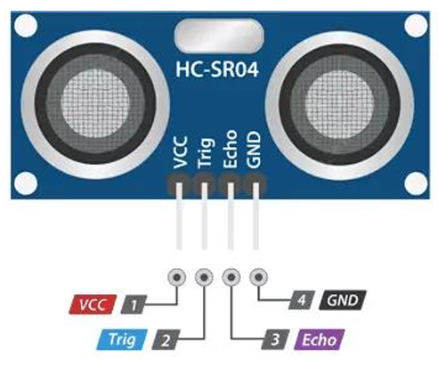
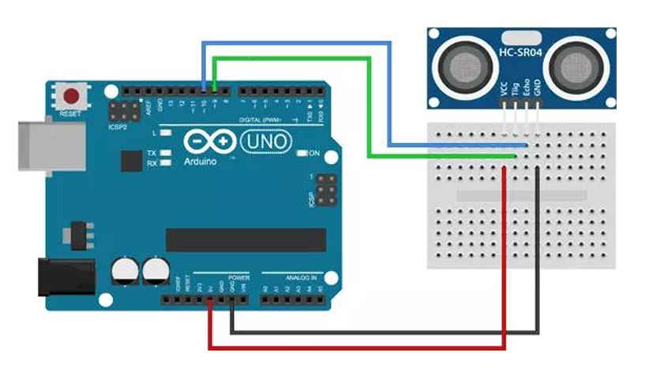
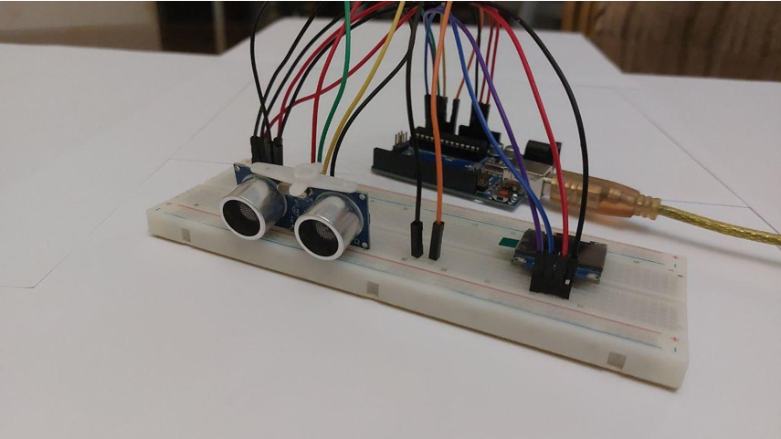
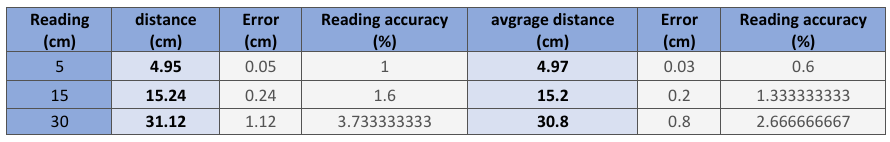
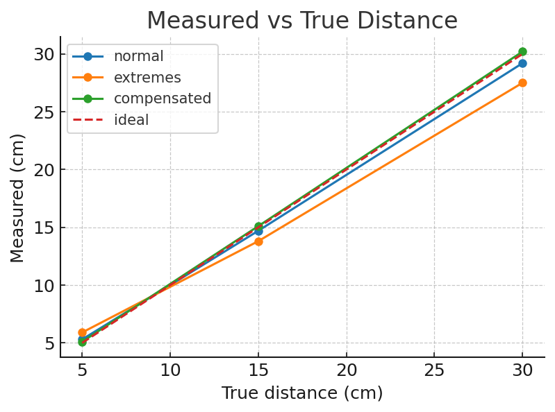
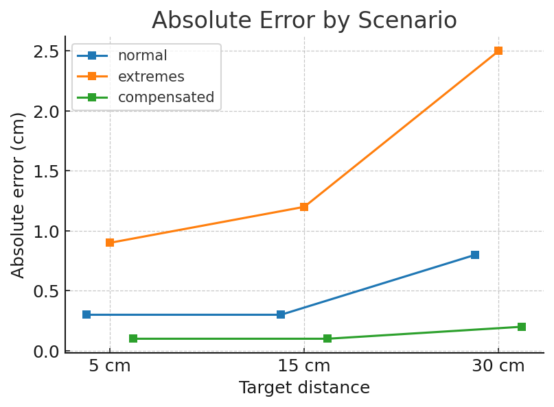

# Ultrasonic Distance Measurement – Instrumentation Final Project

This repository contains the **Semester 7 Instrumentation Course Final Project**, focusing on the design and evaluation of an **ultrasonic distance measurement system** using the **HC-SR04** sensor.  
The project explores the effect of environmental conditions (temperature & humidity) on measurement accuracy and demonstrates **compensation with DHT22** to improve performance.

---

## 📂 Repository Structure
```
.
├── data/
│   ├── raw/                # Raw datasets (CSV)
│   │   ├── normal_5_15_30cm.csv
│   │   ├── extremes_5_15_30cm.csv
│   │   └── compensated_5_15_30cm.csv
│   └── processed/          # Processed results & plots
│       ├── summary_metrics.csv
│       └── plots/
│           ├── measured_vs_true.png
│           └── absolute_error.png
│
├── analysis/               # Error analysis and equations
│   ├── distance_error_analysis.ipynb
│   └── equations.md
│
├── calibration/            # Calibration & environment notes
│   ├── calibration_protocol.md
│   └── env_notes.md
│
├── firmware/               # Arduino code
│   ├── src/
│   │   ├── main_baseline.ino
│   │   ├── main_extremes.ino
│   │   └── main_with_DHT22.ino
│   └── include/
│       └── config.h
│
├── hardware/               # Wiring & schematic docs
│   ├── wiring_fritzing_instructions.md
│   └── wiring_fritzing.fzz (to be added by user)
│
├── images/                 # Images for documentation
│   ├── block_diagram.png
│   ├── wiring_diagram.png
│   ├── hc-sr04_pinout.png
│   ├── wiring_uno_hcsr04.png
│   ├── prototype_breadboard.png
│   └── experiment_setup.png
│
└── README.md
```

---

### Pin Mapping
| Device    | Pin |
|-----------|-----|
| HC-SR04 TRIG | D9 |
| HC-SR04 ECHO | D10 |
| DHT22 DATA   | D7 |
| VCC/GND      | 5V/GND |

---

## ⚙️ Hardware Setup

- **Arduino UNO**  
- **HC-SR04 Ultrasonic Sensor** (measures distance)  
- **DHT22 Sensor** (provides temperature & humidity for compensation)  
- **OLED Display (optional)** for visualization  
- Breadboard, jumper wires  

### Module Pinout


### Wiring Example


### Prototype on Breadboard


### Experiment Setup (5–15–30 cm with reference ruler)


---

## 📊 Experimental Scenarios

The system was tested under **three scenarios**:

1. **Normal conditions** – room temperature and humidity  
2. **Extreme conditions** – unusual temperature & humidity (degraded accuracy)  
3. **Compensated system** – with **DHT22** to dynamically adjust the speed of sound  

Experiments were conducted at reference distances of **5 cm, 15 cm, and 30 cm**.

---

## 📈 Results & Analysis

### Measured vs True Distances


### Absolute Error Comparison


📌 Detailed results can be found in:  
- [summary_metrics.csv](data/processed/summary_metrics.csv)  
- [distance_error_analysis.ipynb](analysis/distance_error_analysis.ipynb)

---

## 🧮 Equations

- **Time of Flight**:  
  \[
  D = \frac{t \times v}{2}
  \]  
  where *t* = echo pulse duration, *v* = speed of sound  

- **Speed of Sound Compensation**:  
  \[
  v \approx 331.4 + 0.6T + 0.0124H
  \]  
  where *T* = temperature (°C), *H* = relative humidity (%)

More details: [equations.md](analysis/equations.md)

---

## 🖥️ Firmware (Arduino)

- `main_baseline.ino` – Normal conditions  
- `main_extremes.ino` – Extreme conditions (without compensation)  
- `main_with_DHT22.ino` – Compensated measurements using DHT22  

Config: [`config.h`](firmware/include/config.h)

---

##  Calibration

Calibration protocol and environment notes can be found in:  
- [calibration_protocol.md](calibration/calibration_protocol.md)  
- [env_notes.md](calibration/env_notes.md)

---

##  Demo Video
Watch the project demonstration on YouTube:  
👉 [Project Video]https://youtube.com/shorts/QiZ3cKU2N_M?feature=share

---

##  Acknowledgment
- **Course**: Instrumentation (Semester 7)  
- **Instructor**: Dr. Babak Tavassoli  
- **Student**: Ali Akbar Mohsennejad 

---

## 🖊️ License
This project is licensed under the [MIT License](LICENSE).  
Feel free to use, modify, and build upon it with attribution.
